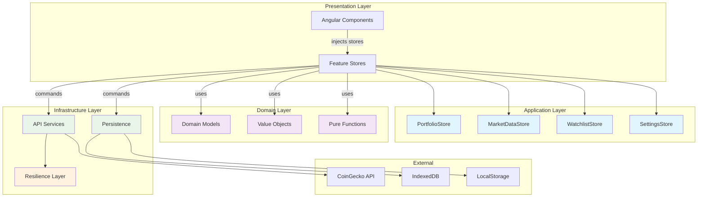

# CryptoVault Pro Architecture Diagram

## Layer Responsibilities

### Presentation Layer
- Angular standalone components
- Lazy-loaded routes
- OnPush change detection
- UI state management

### Application Layer  
- Signal-based feature stores
- Business logic orchestration
- State management commands
- Computed selectors

### Domain Layer
- Pure TypeScript models
- Value objects with validation
- Business calculation functions
- Framework-agnostic logic

### Infrastructure Layer
- External API integration
- Data persistence
- Error handling & resilience
- Browser API abstractions
